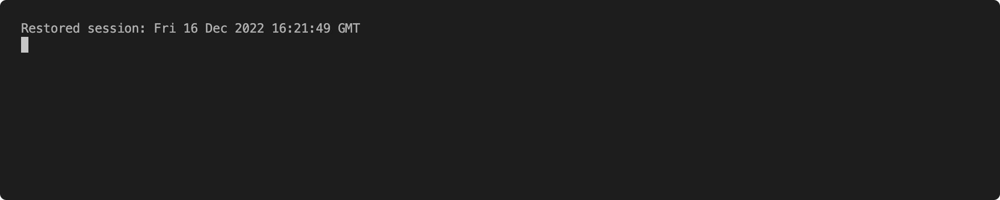

### Introduction

OCR from a IIIF manifest to generate a git patch for [Miiify](https://github.com/nationalarchives/miiify).


### Build the tool

```bash
docker build -t jptmoore/boriiis .
```

### Run the tool



Patching the [annotation repository](https://github.com/jptmoore/annotations) produces https://projectmirador.org/embed/?iiif-content=https://miiify.rocks/manifest/tesseract


### Usage

```
Usage: main.py [OPTIONS]

Options:
  --name TEXT           Name of collection.  [required]
  --manifest TEXT       IIIF manifest.  [required]
  --lang [eng|fra]      Current languages supported.  [default: eng]
  --creator TEXT        Creator of annotations.  [default:
                        john.moore@nationalarchives.gov.uk]
  --page-limit INTEGER  Server-side annotation pagination.  [default: 200]
  --oem INTEGER         Tesseract page engine mode.  [default: 3]
  --psm INTEGER         Tesseract segmentation engine mode.  [default: 3]
  --preview             Text output of OCR.
  --version             Show the version and exit.
  --help                Show this message and exit.
```

### Status

Work in progress
